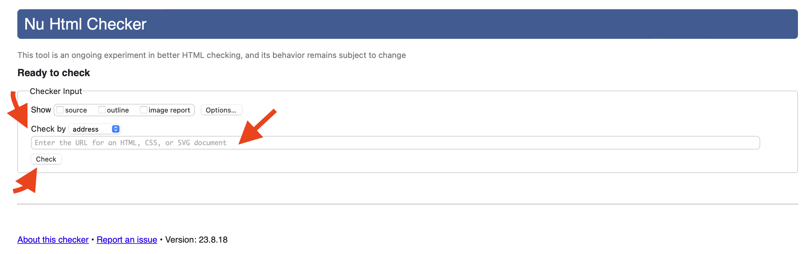

# Tutorial 02

**Course Title**: Web Development

**Course Code**: IRM1005 / ITEC1005

**Semester**: Fall 2023

**Due Date**: n/a

**Assessment**: n/a

## TLDR

1. Download your tutorial code, build out your `index.html` page so that matches the sample screenshot provided, and commit the changes back to your repo.
2. Turn on GitHub Pages.
3. Use the `W3C Validator` to check the compliance status of your live page.
4. Submit a comment in the Tutorial Exercise 02 show and tell discussion board and share a link to your live web page and a link to your validator results.

## Description

The goal of this tutorial is for students to gain experience using `HTML` elements to build a complex web page that is both compliant and has proper semantic structure.

Students will also gain experience using the `W3C Validator` service to ensure their code is complaint.

## Table of contents

- [Instructions](#instructions)
- [Additional Help](#additional-help)
- [Screenshots](#screenshots)
- [Helpful Links](#📚-helpful-links)

## Instructions

You must have completed `Tutorial 1` before attempted this exercise. The instructions below assume you have a working developer environment.

To complete this tutorial you must follow the steps below. Additional help can be found further below.

- Using the `CONTENT.md` file as a guide, and the two screenshots below as a reference, write HTML to mark up your page in your `index.html` file
- If you get stuck, you can use the example in the `solutions` folder for guidance
- Preview your home page on your local machine by using the LivePreview feature in VSCode
- Commit your changes and push to GitHub
- Turn on [GitHub Pages](https://github.com/orgs/irm1005-itec1005-fall-2023/discussions/4) in the `settings` section of your repository
- View your live web page
- Go to the `W3C Validator` [service](https://validator.w3.org/) and input the URL of your web page
- Fix any validation errors that are raised
- In the [Tutorial 02 - Show and Tell discussion](https://github.com/orgs/irm1005-itec1005-fall-2023/discussions/3) in our GitHub Discussion Group, add a comment with a link to your live page as well as a link to your validator results
- Check out some of your other team members pages

## Additional help

### Cloning your tutorial 02 repository

Refer to the Birghtspace videos `Setting up all the things` for instructions on how to setup your local development environment and clone your tutorial repository so that you can work on your code locally.

### Activating GitHub pages

Refer to this [discussion post](https://github.com/orgs/irm1005-itec1005-fall-2023/discussions/4) for instructions on how to turn on the GitHub Pages service for your repository.

### Content for your web page

Use the [Content](./CONTENT.md) file as the source for what content you need to mark up and add to your `index.html` file.

You will need to leverage both HTML semantic elements (`header`, `nav`, `section`, `footer`)and HTML content elements (`p`, `ul`, `img`, `table`, `form`, `h*`) to markup all of the content correctly.

The end result should look very similiar to the screenshot shown below.

### W3C Validator

The [W3C Validator](https://validator.w3.org/nu/) provides an easy way for us to check our web pages and ensure they are compliant.

After you setup GitHub Pages and when your web page is live you can visit the W3C Validator site and paste in the URL of your page and then hit `check` to get the results for your web page.

## Screenshots

### Image of final web page

### Image of semantic structure

## 📚 Helpful links

### HTML

- [Intro to HTML - Prof3ssorSt3v3](https://www.youtube.com/watch?v=KUmuiqV1xME&list=PLyuRouwmQCjncCz8JChyPNRBvm2ONGYa2)
- [HTML Tutorial - MDN](https://developer.mozilla.org/en-US/docs/Learn/HTML)
- [HTML Forms - MDN](https://developer.mozilla.org/en-US/docs/Web/HTML/Element/form)

### GitHub

- [A short video explaining what GitHub is](https://www.youtube.com/watch?v=w3jLJU7DT5E&feature=youtu.be)
- [Git and GitHub learning resources](https://docs.github.com/en/github/getting-started-with-github/git-and-github-learning-resources)
- [Understanding the GitHub flow](https://guides.github.com/introduction/flow/)
- [How to use GitHub branches](https://www.youtube.com/watch?v=H5GJfcp3p4Q&feature=youtu.be)
- [GitHub's Learning Lab](https://lab.github.com/)
- [Education community forum](https://education.github.community/)
- [GitHub community forum](https://github.community/)

### Git

- [Interactive Git training materials](https://githubtraining.github.io/training-manual/#/01_getting_ready_for_class)
